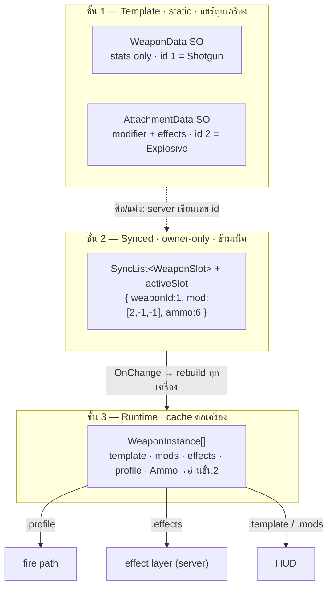
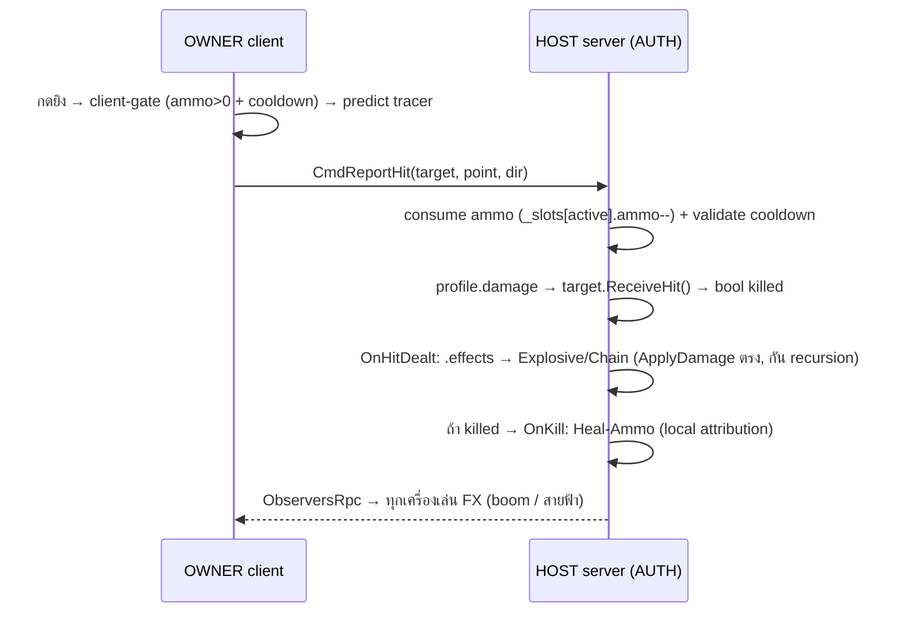

# 0016 — Weapon System (arsenal + swap + attachment + effect layer)

> Phase 6 (post-MVP) · ตัดสิน 2026-08-03 (ผ่าน grill session) · สถานะ: **ออกแบบแล้ว · ยังไม่ build 🔵**

บันทึกว่า "ทำไมจะสร้างเป็นรูปนี้" ก่อนลงมือ — ถ้าจะเปลี่ยนโครง อ่านนี่ก่อน. build จริง **หลังปิด MVP** (16b Direct IP + LAN verify + 16c art)

## บริบท

user อยากได้ระบบ "โมปืน" (customize อาวุธ) + วางฐานให้ต่อยอด effect แปลกๆ ได้ในอนาคต. รากฐานปัจจุบันโตพอควร:
`WeaponData` (abstract SO-as-strategy) + `Hitscan`/`Projectile` subclass, `PlayerWeapon` (ammo/reload/fire-rate + hitscan verified),
pattern multiplier ต่อผู้เล่นจาก `PlayerUpgrades` (task 12b). ระบบนี้ต่อยอดจากของที่ verify แล้วบางส่วน

**ลำดับ:** Weapon ก่อน Skill (refactor ของที่ทำงานอยู่ = รากของ "โมสกิล"), Ping เลื่อนออกไปก่อน

## การตัดสินใจ (grill)

| # | ประเด็น | เลือก | เหตุผลย่อ |
|---|---|---|---|
| 1 | ตำแหน่ง/ลำดับ | **Phase 6 backlog · Weapon ก่อน Skill · Ping เลื่อน** | เกมยังไม่เคย verify multi-peer เลย → ปิด MVP + LAN test ก่อน สร้างทับ. Skill = refactor ability เดิม (รากโมสกิล) |
| 2 | ขอบเขต "โมปืน" | **(C) arsenal + swap + attachment** | user เลือกก้อนใหญ่สุด — คลังปืนหลายกระบอก + สลับ + แต่ง attachment ต่อกระบอก |
| 3 | persistence | **(A) per-run (roguelite)** | เข้ากับ `ResetForReplay` ที่มีอยู่ (gold/upgrades reset ทุกแมตช์). ไม่ต้องมี save system + identity (เกม Direct-IP LAN ไม่มีบัญชี) |
| 4 | slot ปืน | **fixed typed 2 ช่อง** (Primary + Secondary) | ตรง genre KF/FPS · input ชัด (1/2) · slot = enum เพิ่ม Melee/Grenade ทีหลังได้ · คุม balance ง่ายกว่า dynamic list |
| 5 | ได้ปืนมา | **(B) เริ่ม default + ซื้อจากร้าน · universal** | reuse shop window (task 12) + `ShopOpen` + purchase RPC. staging คงแค่ class-select. ใครก็ซื้อได้ทุกกระบอก (ก่อน) |
| 6 | โครง component | **(A) `PlayerWeapon` เดียว refactor เป็น array** | เก็บ fire/reload logic ที่ verify แล้วไว้ที่เดียว · networking surface เล็ก · ammo per-slot |
| 7a | swap ↔ reload | **swap ยกเลิก reload** | กัน exploit "reload A ไปพลาง สู้ด้วย B" · มาตรฐาน KF · rule server ง่าย (swap-away → slot นั้น reloading=false) |
| 7b | equip delay | **instant (ก่อน)** | equip time = polish เพิ่ม timer ทีหลัง (มี `_reloadEndTime` pattern อยู่แล้ว) · ให้ core นิ่งก่อน |
| — | cooldown ยิง | **per-slot** | สลับไปปืนที่พร้อมแล้วยิงได้ทันที = พฤติกรรม FPS ปกติ ไม่ใช่ exploit |
| 8 | projectile weapon | **ใส่ตั้งแต่แรก (ปิดหนี้ task 5)** | เครื่องยนต์ projectile verify แล้วผ่าน Ranger (task 9) — เหลือแค่ prefab `PlayerProjectile` เลียนแบบ `EnemyProjectile` + wiring. de-risk player-projectile path ตั้งแต่ต้น |
| 9 | attachment slot | **(B) generic 3 ช่อง/กระบอก** | ไม่มี compatibility matrix (ชิ้น×ช่อง×ปืน) ที่บานปลาย · mod ใหม่ = สร้าง SO ใส่ได้ทุกช่อง · เติม `category` เป็น typed ทีหลังได้ |
| 10a | mod แก้อะไร | **ตัวเลข + behavior** | user ขอ behavior (fullAuto/pellets/pierce) ไม่ใช่แค่ stat |
| 10b | stack math | **รวม % แล้วคูณครั้งเดียว** × upgrade เดิม | balance คุมง่าย ไม่ระเบิดแบบคูณทบ · ไม่ต้องรื้อ `PlayerUpgrades`. สูตร: `(base + Σflat) × (1 + Σpct) × upgradeMult` |
| 11 | สถาปัตย์ behavior | **(A) fixed vocabulary + resolved `WeaponProfile`** + **server-side effect-hook layer** | shot = profile ก้อนเดียว (server-auth ฟรี, predict ได้). ของแปลก (event-triggered) → effect รันฝั่ง server ล้วน = ปลอดภัย ไม่มี prediction ให้ sync |
| 12 | identity/sync | **catalog + int id · owner-only · mutation ผ่าน Cmd validate** | SO ก๊อปข้ามเน็ตไม่ได้ → sync เลข id + resolve จาก catalog ที่เหมือนกันทุกเครื่อง (หลัก FishNet prefab-id). owner-only พอ (mirror Wallet/Upgrades) |
| — | data model | **`SyncList<WeaponSlot>` ก้อนเดียว** (weaponId+mod×3+ammo) + `SyncVar activeSlot` | cohesive: ขาย/ซื้อ = เขียนทับทั้ง entry → ammo reset atomic ไม่ค้าง (เลี่ยง parallel-array bug). churn เล็กมากบน LAN 4 คน ไม่ต้อง optimize แยก |
| — | runtime cache | **คง `WeaponInstance[]`** (template+mods+effects+profile) | fire อ่าน `.profile`, effect อ่าน `.effects`, HUD อ่าน `.template/.mods` — ก้อนเดียว. ตัดเหลือ profile[] จะบังคับแตก parallel cache ทีหลัง (= fragmentation) |

## effect layer — ของแปลก (Q11 hybrid)

behavior แยก 2 แกน:
- **shot mechanics** (shotgun/pierce/homing) → `WeaponProfile` + fire path (fixed vocabulary)
- **event-triggered effects** (90% ของของแปลก: lifesteal/chain/explosive/freeze/on-kill) → **`WeaponEffect` (SO) รันฝั่ง server** hook เข้า `OnHitDealt`/`OnKill`

ทำไม effect อยู่ฝั่ง server ล้วน → ปลอดภัย: รันหลัง server resolve hit แล้ว = **ไม่มี client prediction ให้ sync** (จุดที่ (B) strategy เปราะใน fire path หายไป). ของแปลกใหม่ = `WeaponEffect` class เล็กๆ 1 ตัว ไม่แตะ core

**3 ตัวอย่างที่จะ build (พิสูจน์ effect layer):**
1. **Heal/Ammo on kill** — `OnKill` → heal + เติม ammo คนยิง
2. **Chain lightning** — `OnHit` → OverlapSphere หา N ตัวใกล้ → damage ต่อลูก + RPC สายฟ้า
3. **Explosive AoE** — `OnHit` → OverlapSphere รอบจุดโดน → damage ทุกตัวในรัศมี + RPC boom

**2 กฎที่ตัดสินแล้ว (กันบั๊ก):**
- **on-kill = local attribution** — ปืนรู้เองว่านัดนี้ฆ่า (`ServerReportHit` เช็ค target ตายไหมหลัง apply) → `IHitReceiver.ReceiveHit` **คืน `bool killed`** (เปลี่ยนเล็ก จุดเดียว) แทนร้อย attacker ผ่าน pipeline. ไม่ขัดกฎเกม "ไม่ track kill credit" (นี่ local ระดับนัด ไม่ใช่ระบบ credit)
- **recursion guard** — effect damage เรียก `ApplyDamage` **ตรง** (ไม่ผ่าน hook) → กันลูป explosion→hit→explosion

## สถาปัตย์ 3 ชั้น (สำคัญสุด)

รูปเต็ม (styled): [assets/0016-weapon-system-flow.html](assets/0016-weapon-system-flow.html)

**loop ที่ผูกทุกชั้น:** server แก้ชั้น 2 (ซื้อ/แต่ง/ยิง) → `OnChange` ยิงในทุกเครื่องที่มีสำเนา (owner + host) → rebuild ชั้น 3 ช่องนั้น (resolve id→SO + คำนวณ profile) → fire/effect/HUD อ่านชั้น 3 ที่สดเสมอ. `WeaponData` ไม่เคยถูก mutate (template ล้วน) — ปืน/mod ต่อผู้เล่นเก็บที่ชั้น 2/3

## flow: กดยิง → โดน → effect

**2 จังหวะ:** owner predict ให้ลื่น · host ชี้ขาด (damage/ammo/effect เกิดฝั่ง host ที่เดียว = กันโกง)

## แตกเป็น sub-task (เรียงตาม dependency)

| # | task | ทำอะไร | verify |
|---|---|---|---|
| **W1** | Arsenal foundation | `WeaponCatalog` SO · refactor `PlayerWeapon` → `SyncList<WeaponSlot>` + activeSlot + cache `WeaponInstance[]` · 2 ช่อง swap (cancel reload, instant) · `Resolve(base→profile)` fold upgrade เดิม · fire path ขับด้วย profile+activeSlot | swap · ammo แยกช่อง · reload แยกช่อง · damage server-auth |
| **W2** | Projectile weapon | `PlayerProjectile` prefab (trigger+kinematic RB+damageMask=Enemy+blockMask) · `ProjectileWeaponData`→ชี้ prefab ใหม่ + เข้า catalog · `profile.isProjectile` ขับ SpawnProjectile | ปืน projectile ยิงโดน enemy จริง (ปิดหนี้ task 5) |
| **W3** | Attachment system | `AttachmentData` SO (ตัวเลข + behavior: forceFullAuto/addPellets+spread/addPierce) · `AttachmentCatalog` · Resolve fold mod (10b) · fire path จัดการ pellets/spread/pierce · `CmdEquipAttachment` validate | ใส่ mod → profile เปลี่ยน · shotgun/pierce ทำงาน |
| **W4** | Shop integration | ขยายร้าน → 3 หมวด (ปืน/attachment/stat เดิม) · `CmdBuyWeapon`/`CmdEquipAttachment` wire ร้าน (ขายปืน = เขียนทับ WeaponSlot → ammo reset atomic) | ซื้อปืนลงช่อง · ซื้อ+ใส่ mod · gold หัก |
| **W5** | Effect-hook layer + 3 ตัวอย่าง | `WeaponEffect` SO + `EffectContext` · hook `OnHitDealt`/`OnKill` (server) · `ReceiveHit` คืน bool killed · effect damage → `ApplyDamage` ตรง · 3 effect (Explosive/Chain/Heal-Ammo) | แต่ละ effect + ไม่ recurse |

## ขอบเขต — task นี้ *ไม่* ทำ

held-weapon visual เพื่อน (→ all-read ตอนทำ art/viewmodel) · typed attachment slot (เติม `category` ทีหลัง) · persistent progression/save (per-run เท่านั้น) · class-restricted weapon (universal ก่อน) · behavior-strategy plugin ใน fire path (fixed vocabulary + effect-hook แทน) · Ping system (คิวถัดไป) · Skill system generalize (คิวถัดไป — จะยืมโครง SO-strategy + effect layer นี้)

## เตรียมให้ต่อ

- **Skill system (คิวถัดไป):** generalize `HealPulseAbility` → `AbilityData` SO เลียนแบบ pattern เดียวกับ `WeaponData`/effect layer นี้ ("โมสกิล" = สร้าง SO asset)
- **held-weapon visual:** เปลี่ยน `WeaponSlot`/`activeSlot` → all-read เมื่อทำ viewmodel (เพื่อนเห็นปืนที่ถือ)
- **weapon-swap balance:** equip delay (7b) เป็น timer เพิ่มทีหลังถ้าต้องการน้ำหนัก
